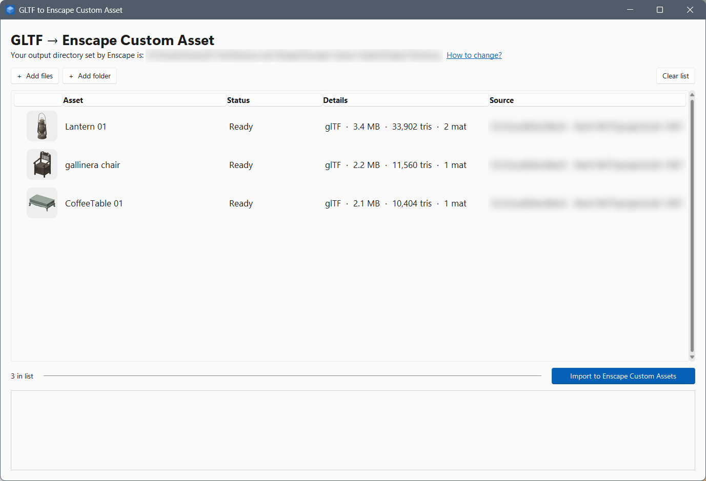
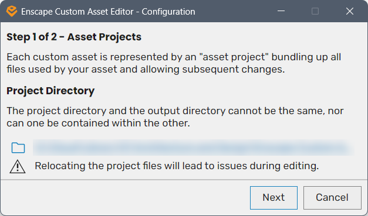
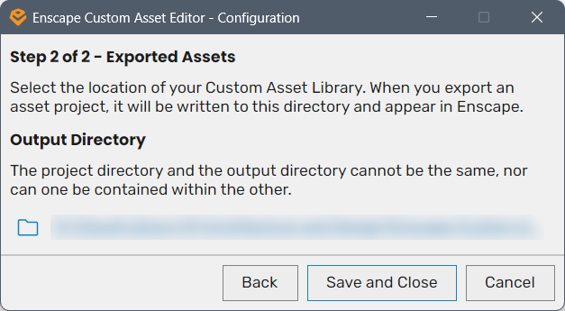

# GLTF to Enscape Custom Asset

**Turn downloaded 3D models (`.gltf` / `.glb`) into Enscape Custom Assets in one go. Drag, drop, click one button.**



---

## Why does this exist?

Lots of great free 3D models (furniture, lamps, plants...) come as **glTF** files (`.gltf` or `.glb`).
To use them in Enscape you have to turn each one into a *Custom Asset*. Doing that by hand in the Enscape Custom Asset Editor means:

- importing **one model at a time**, clicking through several screens for each;
- fixing materials by hand, because glTF models often show up in Enscape as **shiny metal** (wood and fabric looking like chrome);
- `.glb` files can't be opened at all; the editor only takes `.gltf`, `.obj` and `.fbx`.

This app does all of that for you:

- **Many models at once**: drop a whole folder and walk away.
- **Materials fixed automatically**: wood stays wood, metal stays metal.
- **`.glb` works too**: it's converted behind the scenes.
- Uses **Enscape's own importer**, so the result is exactly what the Custom Asset Editor would make: textures, thumbnail and all.
  The assets render in Enscape (and V-Ray too).

---

## Before you start: set up Enscape's folders (once)

> [!IMPORTANT]
> The app puts your new assets in the **Output Directory** you chose in Enscape's Custom Asset Editor.
> **If that folder isn't set up correctly, your assets won't show up in Enscape.** Please take two minutes to check it.

1. Open the **Enscape Custom Asset Editor** (Windows Start menu, search *Enscape Custom Asset Editor*).
   The first time you open it, it asks for two folders. (Already set up? Click **Configure** at the top right of the
   editor to see or change them.)

2. **Step 1 – Project Directory.** This is where Enscape keeps an editable "project" for every asset.
   Pick any folder you like, for example `Documents\Enscape Custom Assets\Projects`.

   

3. **Step 2 – Output Directory.** ⭐ **This is the important one.** It's your *Custom Asset Library*: the folder Enscape
   reads to show your custom assets. Everything this app imports lands here.

   

   - Pick a **different** folder from step 1, and **not inside it** (and the step 1 folder must not be inside this one).
     Two side-by-side folders work well, e.g. `...\Enscape Custom Assets\Projects` and `...\Enscape Custom Assets\Library`.
   - Want to share assets with your team? Put this folder somewhere everyone can reach (a shared drive or synced cloud folder).
   - Click **Save and Close**.

4. **Make Enscape look in the same folder.** In Revit (or your CAD app) open **Enscape → Asset Library → Custom Assets** tab.
   Click the **folder icon** at the bottom right and choose the **same Output Directory** as in step 3.
   If these two don't match, Enscape shows *0 custom assets* even though the import worked.

When you open this app, the top line tells you which Output Directory it will use:

> *Your output directory set by Enscape is: ...*

If that's not the folder you expect, click **How to change?** right next to it. A short guide pops up with a button that
opens the Enscape Custom Asset Editor for you. The app notices the new folder by itself, no restart needed.

---

## Download

1. Go to the [**Releases**](../../releases/latest) page and download **`GLTF to Enscape Custom Asset.exe`**.
2. Put it anywhere (Desktop, a tools folder...). There is nothing to install.
3. The first time you run it, Windows may show **"Windows protected your PC"**, because the app isn't signed.
   Click **More info → Run anyway**.

You need **Enscape** installed on the same computer (tested with Enscape 4.7) and Windows 10 or 11.

---

## How to use

1. **Add models.** Drag `.gltf` / `.glb` files, or whole folders, onto the window. You can also use **Add files** /
   **Add folder**, or drop them straight onto the app's icon.
   Each model shows a small preview, its size and how detailed it is.
2. **Check the names** (optional). The asset name in Enscape is taken from the file name.
   **Double-click** a row to change the name or add a description (e.g. where the model came from, its licence).
3. Click **Import to Enscape Custom Assets**. Each model takes about 15 seconds.
   When a row says **✓ Imported**, the thumbnail switches to the one Enscape made.
4. **Use it.** In Enscape open **Asset Library → Custom Assets** and **double-click** your new asset to place it.

Good to know:

- **Importing the same model twice gives you two copies** in Enscape. Rows marked *Ready (already present)* already have an
  asset with that name.
- If a row turns red (**✕ Failed**), the box at the bottom explains why, usually a broken or incomplete model file.
  Models whose textures sit next to the `.gltf` file need those texture files to stay in place.
- **Stop** finishes the model it's working on and then stops.

---

## Troubleshooting

| What you see | What to do |
| --- | --- |
| Enscape shows **0 custom assets** | Enscape's *Custom Assets* folder (step 4) isn't the same as the Output Directory (step 3). Make them the same. |
| The top line says the output directory **is not set** | Open the Enscape Custom Asset Editor once and finish both setup steps. |
| *Enscape batch importer not found* | Enscape isn't installed, or is in a non-standard place. Install or repair Enscape. |
| A wooden/fabric model still looks metallic | Rare. Open the asset in the Enscape Custom Asset Editor and lower **Metallic** for that material. |

---

## How it works (for the curious)

For each model the app:

1. makes a temporary copy named after the asset (Enscape takes the name from the file name), unpacking `.glb` into `.gltf`;
2. sets each material's metal value from its texture, because glTF defaults to "fully metal";
3. runs Enscape's own batch importer (`Enscape.CustomAssetBatchImporter.exe`, installed with Enscape), which writes the asset
   to your **Output Directory** and an editable project (`.assetpkg`) to your **Project Directory**;
4. adds your description to both, then deletes the temporary copy.

Your original model files are never changed.

### Building from source

Requires Python 3.12 on Windows.

```bash
pip install pyinstaller tkinterdnd2 sv-ttk pillow
```

Then run `build.bat`. The app is created at `dist\GLTF to Enscape Custom Asset.exe`. The source is a single file: `gltf2enscape.py`.

---

*Not affiliated with or endorsed by Chaos or Enscape. "Enscape" is a trademark of its owner.*

## License

MIT. See [LICENSE](LICENSE). Not affiliated with or endorsed by Enscape or Chaos.
